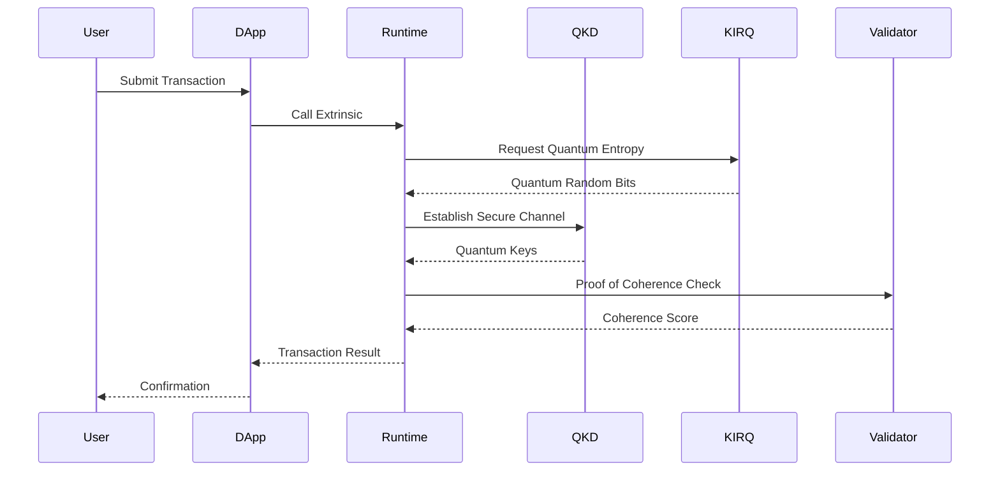

# QuantumHarmony Ecosystem Architecture

## Complete System Diagram

```mermaid
graph TB
    subgraph "Application Layer"
        DAPP[DApps & Smart Contracts]
        WALLET[Quantum Wallets]
        BRIDGE[Cross-Chain Bridge]
        ORACLE[Quantum Oracle Network]
    end

    subgraph "QuantumHarmony Blockchain"
        subgraph "Runtime"
            QC[Quantum Crypto Pallet<br/>1MB Entropy Pool]
            POC[Proof of Coherence Pallet<br/>Harmonic Consensus]
            BAL[Balances Pallet]
            GOV[Governance Pallet]
        end
        
        subgraph "Consensus Layer"
            TONNETZ[Tonnetz Lattice<br/>Musical Mathematics]
            HARMONIC[Harmonic Resonance<br/>Validator Selection]
            VRF[Quantum VRF<br/>Leader Election]
        end
        
        subgraph "P2P Network"
            QKD_P2P[QKD Protocol<br/>/quantum-harmony/qkd/1.0.0]
            TEMPORAL[Temporal Ratchet<br/>Forward Secrecy]
            LIBP2P[libp2p Transport<br/>Quantum Enhanced]
        end
    end

    subgraph "Quantum Infrastructure"
        KIRQ[KIRQ Hub<br/>Entropy Service<br/>Port 8099]
        TOSHIBA[Toshiba QKD<br/>Hardware]
        CNT[Carbon Nanotube<br/>Repeaters<br/>(Planned)]
        ETSI[ETSI QKD API<br/>Standard Interface]
    end

    subgraph "Cryptographic Layer"
        SPHINCS[SPHINCS+<br/>Post-Quantum Signatures]
        FALCON[Falcon-512<br/>PQ Signatures]
        ZKSTARK[ZK-STARKs<br/>Quantum Measurement<br/>Certification]
        BB84[BB84 Protocol<br/>QKD Implementation]
    end

    subgraph "Integration Points"
        POLKADOT[Polkadot SDK<br/>Substrate Framework]
        COSMOS[Cosmos IBC<br/>(Future)]
        ETHEREUM[Ethereum Bridge<br/>(Future)]
    end

    %% Connections
    DAPP --> QC
    WALLET --> BAL
    BRIDGE --> GOV
    ORACLE --> KIRQ

    QC --> KIRQ
    POC --> TONNETZ
    TONNETZ --> HARMONIC
    HARMONIC --> VRF
    VRF --> KIRQ

    QKD_P2P --> TEMPORAL
    TEMPORAL --> LIBP2P
    LIBP2P --> ETSI
    ETSI --> TOSHIBA
    ETSI --> CNT

    QC --> SPHINCS
    QC --> FALCON
    POC --> ZKSTARK
    QKD_P2P --> BB84

    POLKADOT --> Runtime
    COSMOS -.-> BRIDGE
    ETHEREUM -.-> BRIDGE

    %% Styling
    classDef quantum fill:#e1f5ff,stroke:#0066cc,stroke-width:2px
    classDef consensus fill:#ffe6e6,stroke:#cc0000,stroke-width:2px
    classDef crypto fill:#f0f0f0,stroke:#666666,stroke-width:2px
    classDef app fill:#e6ffe6,stroke:#00cc00,stroke-width:2px
    classDef future fill:#fff3cd,stroke:#ffcc00,stroke-width:2px,stroke-dasharray: 5 5

    class KIRQ,TOSHIBA,CNT,ETSI,QKD_P2P,TEMPORAL quantum
    class TONNETZ,HARMONIC,VRF,POC consensus
    class SPHINCS,FALCON,ZKSTARK,BB84 crypto
    class DAPP,WALLET,BRIDGE,ORACLE app
    class COSMOS,ETHEREUM,CNT future
```

## Data Flow Architecture



## Technology Stack Layers

```
┌─────────────────────────────────────────────────────────┐
│                   User Interface Layer                   │
│         (Wallets, DApps, Block Explorers)               │
├─────────────────────────────────────────────────────────┤
│                  Application Layer                       │
│    (Smart Contracts, Oracles, Cross-chain Bridges)      │
├─────────────────────────────────────────────────────────┤
│                QuantumHarmony Runtime                    │
│  (Quantum Crypto, Proof of Coherence, Governance)       │
├─────────────────────────────────────────────────────────┤
│                  Consensus Layer                         │
│    (Tonnetz Lattice, Harmonic Resonance, VRF)          │
├─────────────────────────────────────────────────────────┤
│              Quantum P2P Network Layer                   │
│     (QKD Channels, Temporal Ratchet, libp2p)           │
├─────────────────────────────────────────────────────────┤
│             Quantum Hardware Layer                       │
│      (KIRQ Hub, Toshiba QKD, CNT Repeaters)            │
├─────────────────────────────────────────────────────────┤
│            Cryptographic Primitives                      │
│   (SPHINCS+, Falcon-512, ZK-STARKs, BB84)              │
└─────────────────────────────────────────────────────────┘
```

## Key Innovation Areas

### 1. Quantum-Native Consensus
- **Proof of Coherence**: World's first harmonic consensus mechanism
- **Tonnetz Mathematics**: Musical theory applied to blockchain
- **Energy Efficient**: 99% less energy than PoW

### 2. Direct QKD Integration
- **Transport Layer**: QKD at libp2p level (unique approach)
- **Temporal Ratchet**: Time-based key rotation
- **Hardware Agnostic**: ETSI standard compliance

### 3. Post-Quantum Security
- **Multiple Algorithms**: SPHINCS+ and Falcon-512
- **ZK-STARK Proofs**: Quantum measurement certification
- **Future Proof**: Ready for quantum computing era

### 4. Quantum Entropy System
- **KIRQ Integration**: Direct quantum randomness
- **1MB Entropy Pool**: Large quantum random buffer
- **VRF Enhancement**: Quantum-seeded leader election

## Strategic Next Steps

### Phase 1: Technical Completion (Weeks 1-2)
1. ✅ Fix runtime compilation errors (COMPLETED)
2. ⏳ Resolve SPHINCS+ and network conflicts
3. ⏳ Complete KIRQ local integration
4. ⏳ Full system testing

### Phase 2: STARK Integration (Weeks 3-6)
1. 🎯 Implement quantum measurement proofs
2. 🎯 Deploy recursive STARK aggregation
3. 🎯 Create verifier contracts
4. 🎯 Quantum-classical bridge testing

### Phase 3: Testnet Launch (Weeks 7-12)
1. 🚀 Multi-node quantum network
2. 🚀 Public testnet deployment
3. 🚀 Developer documentation
4. 🚀 Community building

### Phase 4: Production Deployment (Months 4-6)
1. 💎 Real QKD hardware integration
2. 💎 CNT repeater prototypes
3. 💎 Enterprise partnerships
4. 💎 Mainnet launch

## Competitive Advantages

1. **First Mover**: Only blockchain with native QKD at transport layer
2. **Novel Consensus**: Proof of Coherence is completely unique
3. **Quantum Ready**: Built for the post-quantum era
4. **Energy Efficient**: Sustainable consensus mechanism
5. **Hardware Patents**: CNT repeater technology

## Target Applications

- 🔐 Quantum-secure messaging
- 🎲 Verifiable random number services
- 🏛️ Post-quantum certificate authority
- 💰 Quantum-enhanced DeFi
- 🤖 AI governance systems
- 🌐 Global quantum communication network